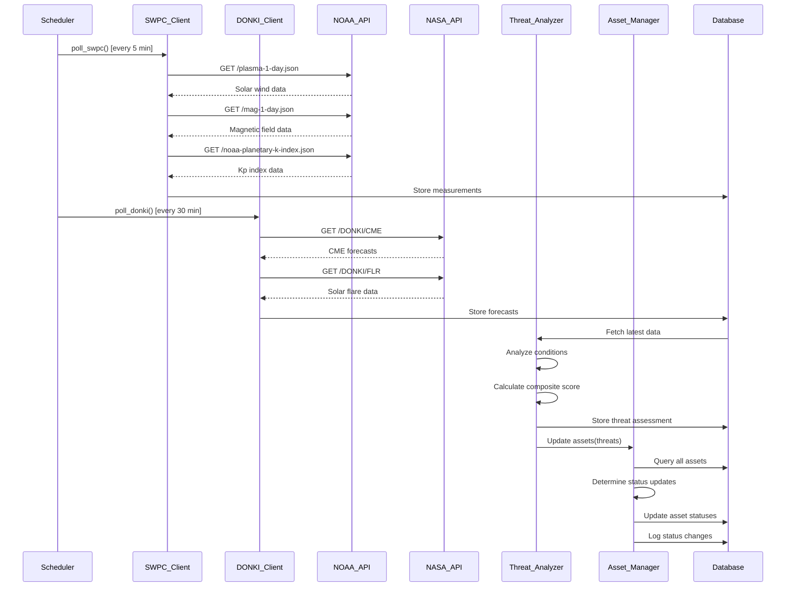
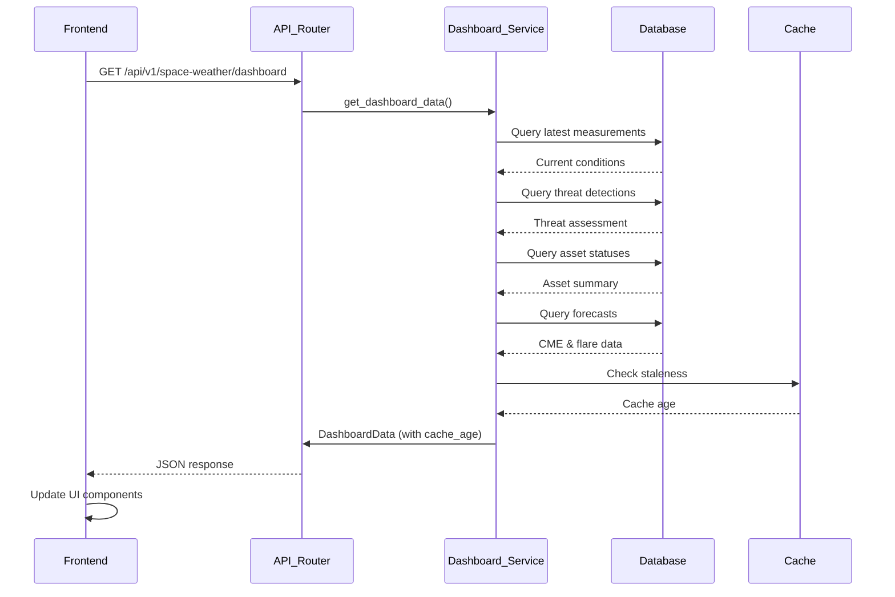
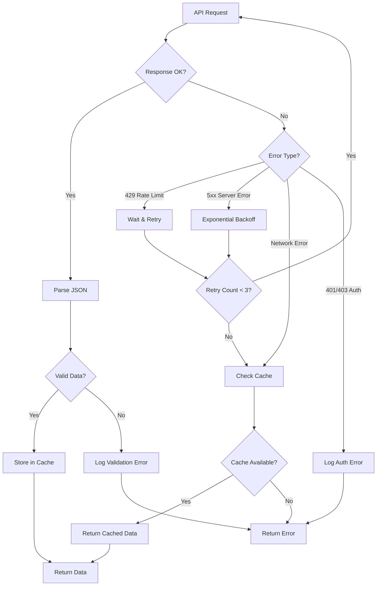

# Design Document: Space Weather Integration

## Overview

The Space Weather Integration feature enables real-time monitoring and threat detection for space weather events that could impact satellites and other critical infrastructure. The system integrates data from two external sources:

- **NOAA Space Weather Prediction Center (SWPC)**: Provides real-time measurements of solar wind, magnetic field, and Kp-index
- **NASA DONKI (Database Of Notifications, Knowledge, Information)**: Provides forecast data for CMEs and solar flares

The architecture follows a layered approach:
1. **External API Clients**: Fetch and parse data from NOAA and NASA APIs
2. **Threat Analysis Engine**: Evaluates conditions and calculates threat scores
3. **Asset Management**: Updates asset statuses based on detected threats
4. **Dashboard API**: Provides unified endpoints for frontend consumption
5. **Data Persistence**: Stores historical data for trend analysis

The system operates on a polling model with configurable intervals (5 minutes for SWPC, longer for DONKI) and includes robust error handling with caching and retry logic.

## Architecture

### System Components

```
┌─────────────────────────────────────────────────────────────┐
│                     Frontend Dashboard                       │
│              (Next.js - orbital-front)                       │
└────────────────────────┬────────────────────────────────────┘
                         │ HTTP/REST
                         ▼
┌─────────────────────────────────────────────────────────────┐
│                   FastAPI Backend                            │
│                (orbital-back/main.py)                        │
│                                                              │
│  ┌──────────────────────────────────────────────────────┐  │
│  │         Space Weather Router                         │  │
│  │      (routers/space_weather.py)                      │  │
│  └──────────────────┬───────────────────────────────────┘  │
│                     │                                        │
│  ┌──────────────────▼───────────────────────────────────┐  │
│  │         Dashboard Service                            │  │
│  │    (services/dashboard_service.py)                   │  │
│  └──────────────────┬───────────────────────────────────┘  │
│                     │                                        │
│  ┌──────────────────▼───────────────────────────────────┐  │
│  │         Threat Analyzer                              │  │
│  │    (services/threat_analyzer.py)                     │  │
│  └──────────────────┬───────────────────────────────────┘  │
│                     │                                        │
│  ┌──────────────────▼───────────────────────────────────┐  │
│  │         Asset Manager                                │  │
│  │    (services/asset_manager.py)                       │  │
│  └──────────────────┬───────────────────────────────────┘  │
│                     │                                        │
└─────────────────────┼────────────────────────────────────────┘
                      │
         ┌────────────┴────────────┐
         ▼                         ▼
┌──────────────────┐      ┌──────────────────┐
│   SWPC Client    │      │   DONKI Client   │
│ (clients/swpc.py)│      │(clients/donki.py)│
└────────┬─────────┘      └────────┬─────────┘
         │                         │
         ▼                         ▼
┌──────────────────┐      ┌──────────────────┐
│   NOAA SWPC API  │      │  NASA DONKI API  │
│  (External)      │      │   (External)     │
└──────────────────┘      └──────────────────┘
```

### Data Flow

1. **Polling Cycle**: Background task polls SWPC every 5 minutes, DONKI every 30 minutes
2. **Data Ingestion**: Clients fetch and parse JSON responses into domain objects
3. **Threat Analysis**: Analyzer evaluates conditions against thresholds
4. **Asset Updates**: Manager updates database records based on threat classifications
5. **Dashboard Queries**: Frontend fetches aggregated data via REST endpoints

### Technology Stack

- **Backend**: FastAPI (Python 3.10+)
- **Database**: PostgreSQL with SQLAlchemy ORM
- **HTTP Client**: httpx (async support)
- **Background Tasks**: APScheduler for polling
- **Frontend**: Next.js with TypeScript
- **Data Validation**: Pydantic models

## Components and Interfaces

### External API Clients

#### SWPC Client (`clients/swpc_client.py`)

Responsible for fetching real-time data from NOAA SWPC endpoints.

**Key Methods**:
```python
class SWPCClient:
    async def fetch_solar_wind(self) -> SolarWindData
    async def fetch_magnetic_field(self) -> MagneticFieldData
    async def fetch_kp_index(self) -> KpIndexData
    async def fetch_all(self) -> SpaceWeatherSnapshot
```

**Endpoints**:
- `https://services.swpc.noaa.gov/products/solar-wind/plasma-1-day.json`
- `https://services.swpc.noaa.gov/products/solar-wind/mag-1-day.json`
- `https://services.swpc.noaa.gov/products/noaa-planetary-k-index.json`

**Error Handling**:
- HTTP 429: Wait 60 seconds, retry
- HTTP 5xx: Exponential backoff (3 retries)
- Network errors: Return cached data with staleness indicator

#### DONKI Client (`clients/donki_client.py`)

Responsible for fetching forecast data from NASA DONKI.

**Key Methods**:
```python
class DONKIClient:
    async def fetch_cme_forecasts(self, start_date: str, end_date: str) -> List[CMEForecast]
    async def fetch_solar_flares(self, start_date: str, end_date: str) -> List[SolarFlare]
    async def fetch_all_forecasts(self) -> ForecastSnapshot
```

**Endpoints**:
- `https://api.nasa.gov/DONKI/CME?api_key={key}&startDate={date}&endDate={date}`
- `https://api.nasa.gov/DONKI/FLR?api_key={key}&startDate={date}&endDate={date}`

**Authentication**: Requires NASA API key from environment variable `NASA_API_KEY`

**Error Handling**:
- HTTP 401/403: Return authentication error
- HTTP 429: Wait 300 seconds, retry
- HTTP 5xx: Exponential backoff (3 retries)

### Services

#### Threat Analyzer (`services/threat_analyzer.py`)

Evaluates space weather conditions and determines threat levels.

**Key Methods**:
```python
class ThreatAnalyzer:
    def analyze(self, snapshot: SpaceWeatherSnapshot, forecasts: ForecastSnapshot) -> ThreatAssessment
    def calculate_composite_score(self, threats: List[ThreatClassification]) -> float
    def detect_shield_breach(self, solar_wind: SolarWindData, mag_field: MagneticFieldData) -> bool
    def detect_geomagnetic_storm(self, kp_index: KpIndexData) -> bool
    def detect_incoming_cme(self, cmes: List[CMEForecast]) -> bool
    def detect_radiation_storm(self, flares: List[SolarFlare]) -> bool
```

**Threat Classifications**:
- `SHIELD_BREACH`: Solar wind speed > 600 km/s AND IMF Bz < -10 nT
- `GEOMAGNETIC_STORM`: Kp index > 7.0
- `INCOMING_CME`: Earth-directed CME with speed > 1000 km/s
- `RADIATION_STORM`: X-class solar flare detected

**Composite Score Calculation**:
```
score = (shield_breach * 40) + (geomagnetic_storm * 30) + (incoming_cme * 20) + (radiation_storm * 10)
```

#### Asset Manager (`services/asset_manager.py`)

Updates asset statuses based on threat classifications.

**Key Methods**:
```python
class AssetManager:
    async def update_asset_statuses(self, threats: ThreatAssessment, db: Session) -> StatusUpdateResult
    async def restore_safe_status(self, db: Session) -> StatusUpdateResult
    async def get_asset_summary(self, db: Session) -> AssetStatusSummary
```

**Status Update Rules**:
- `SHIELD_BREACH` → All satellites to `CRITICAL`
- `GEOMAGNETIC_STORM` → Transformers/power grids to `CAUTION`
- `RADIATION_STORM` → Aircraft to `CAUTION`
- No threats → All assets to `SAFE`

#### Dashboard Service (`services/dashboard_service.py`)

Provides unified data aggregation for frontend consumption.

**Key Methods**:
```python
class DashboardService:
    async def get_current_conditions(self, db: Session) -> CurrentConditions
    async def get_threat_status(self, db: Session) -> ThreatStatus
    async def get_asset_summary(self, db: Session) -> AssetStatusSummary
    async def get_forecast_data(self, db: Session) -> ForecastData
```

### API Router (`routers/space_weather.py`)

Exposes REST endpoints for frontend consumption.

**Endpoints**:
```
GET /api/v1/space-weather/current
GET /api/v1/space-weather/threats
GET /api/v1/space-weather/assets
GET /api/v1/space-weather/forecasts
GET /api/v1/space-weather/dashboard
```

## Data Models

### Database Models (`models.py`)

```python
class SolarWindMeasurement(Base):
    __tablename__ = "solar_wind_measurements"
    id: int
    speed_kmps: float
    density_ppcm: float
    timestamp: datetime
    created_at: datetime

class MagneticFieldMeasurement(Base):
    __tablename__ = "magnetic_field_measurements"
    id: int
    bz_nt: float
    bt_nt: float
    timestamp: datetime
    created_at: datetime

class KpIndexMeasurement(Base):
    __tablename__ = "kp_index_measurements"
    id: int
    kp_value: float
    status: str  # QUIET, ACTIVE, STORM
    observed_time: datetime
    created_at: datetime

class CMEEvent(Base):
    __tablename__ = "cme_events"
    id: int
    activity_id: str
    speed_kmps: float
    is_earth_directed: bool
    start_time: datetime
    high_priority: bool
    created_at: datetime

class SolarFlareEvent(Base):
    __tablename__ = "solar_flare_events"
    id: int
    class_type: str  # B, C, M, X
    peak_time: datetime
    source_location: str
    priority: str  # NORMAL, HIGH, EXTREME
    created_at: datetime

class ThreatDetection(Base):
    __tablename__ = "threat_detections"
    id: int
    classification: str  # SHIELD_BREACH, GEOMAGNETIC_STORM, etc.
    composite_score: float
    active_threats: JSON
    timestamp: datetime
    created_at: datetime

class AssetStatusLog(Base):
    __tablename__ = "asset_status_logs"
    id: int
    asset_id: int
    asset_type: str
    previous_status: str
    new_status: str
    threat_classification: str
    timestamp: datetime
```

### Pydantic Schemas (`schemas.py`)

```python
class SolarWindData(BaseModel):
    speed_kmps: float
    density_ppcm: float
    timestamp: datetime

class MagneticFieldData(BaseModel):
    bz_nt: float
    bt_nt: float
    timestamp: datetime

class KpIndexData(BaseModel):
    kp_value: float
    status: str
    observed_time: datetime

class CMEForecast(BaseModel):
    activity_id: str
    speed_kmps: float
    is_earth_directed: bool
    start_time: datetime
    high_priority: bool

class SolarFlare(BaseModel):
    class_type: str
    peak_time: datetime
    source_location: str
    priority: str

class SpaceWeatherSnapshot(BaseModel):
    solar_wind: SolarWindData
    magnetic_field: MagneticFieldData
    kp_index: KpIndexData
    fetched_at: datetime

class ForecastSnapshot(BaseModel):
    cme_forecasts: List[CMEForecast]
    solar_flares: List[SolarFlare]
    fetched_at: datetime

class ThreatClassification(str, Enum):
    SHIELD_BREACH = "SHIELD_BREACH"
    GEOMAGNETIC_STORM = "GEOMAGNETIC_STORM"
    INCOMING_CME = "INCOMING_CME"
    RADIATION_STORM = "RADIATION_STORM"

class ThreatAssessment(BaseModel):
    active_threats: List[ThreatClassification]
    composite_score: float
    timestamp: datetime

class AssetStatus(str, Enum):
    SAFE = "SAFE"
    CAUTION = "CAUTION"
    CRITICAL = "CRITICAL"
    OFFLINE = "OFFLINE"

class AssetStatusSummary(BaseModel):
    safe_count: int
    caution_count: int
    critical_count: int
    offline_count: int
    by_type: Dict[str, Dict[str, int]]

class DashboardData(BaseModel):
    current_conditions: SpaceWeatherSnapshot
    threats: ThreatAssessment
    assets: AssetStatusSummary
    forecasts: ForecastSnapshot
    cache_age_seconds: Optional[int] = None
```

### Frontend Types (`orbital-front/src/types/space-weather.ts`)

```typescript
export interface SolarWindData {
  speed_kmps: number;
  density_ppcm: number;
  timestamp: string;
}

export interface MagneticFieldData {
  bz_nt: number;
  bt_nt: number;
  timestamp: string;
}

export interface KpIndexData {
  kp_value: number;
  status: "QUIET" | "ACTIVE" | "STORM";
  observed_time: string;
}

export interface ThreatAssessment {
  active_threats: string[];
  composite_score: number;
  timestamp: string;
}

export interface AssetStatusSummary {
  safe_count: number;
  caution_count: number;
  critical_count: number;
  offline_count: number;
  by_type: Record<string, Record<string, number>>;
}

export interface DashboardData {
  current_conditions: {
    solar_wind: SolarWindData;
    magnetic_field: MagneticFieldData;
    kp_index: KpIndexData;
    fetched_at: string;
  };
  threats: ThreatAssessment;
  assets: AssetStatusSummary;
  forecasts: {
    cme_forecasts: CMEForecast[];
    solar_flares: SolarFlare[];
    fetched_at: string;
  };
  cache_age_seconds?: number;
}
```


## Correctness Properties

*A property is a characteristic or behavior that should hold true across all valid executions of a system—essentially, a formal statement about what the system should do. Properties serve as the bridge between human-readable specifications and machine-verifiable correctness guarantees.*

### Property Reflection

After analyzing all acceptance criteria, several properties can be consolidated:

- **Timestamp parsing** (1.4, 2.4, 3.3, 4.5, 5.3): All timestamp parsing can be covered by a single round-trip property
- **Field extraction** (1.2, 1.3, 2.2, 2.3, 3.2, 4.2-4.4, 5.2, 5.4): Multiple field extraction properties can be combined into comprehensive parsing properties
- **Error handling** (1.5, 2.5): Same caching behavior, covered by one property
- **API authentication** (4.1, 5.1): Same authentication mechanism, covered by one example
- **Serialization round-trips** (10.1-10.6): Explicitly designed as round-trip properties

The following properties provide unique validation value after consolidation:

### Property 1: JSON Parsing Round-Trip for Space Weather Data

*For any* valid SpaceWeatherSnapshot object (containing solar wind, magnetic field, and Kp index data), serializing to JSON then parsing back SHALL produce an equivalent object with all fields preserved.

**Validates: Requirements 10.1, 10.3, 10.5**

### Property 2: JSON Parsing Round-Trip for Forecast Data

*For any* valid ForecastSnapshot object (containing CME and solar flare forecasts), serializing to JSON then parsing back SHALL produce an equivalent object with all fields preserved.

**Validates: Requirements 10.2, 10.4, 10.6**

### Property 3: Kp Index Classification Boundaries

*For any* Kp value between 0.00 and 9.00, the classification SHALL be QUIET when 0 ≤ Kp ≤ 4, ACTIVE when 5 ≤ Kp ≤ 6, and STORM when 7 ≤ Kp ≤ 9, with no gaps or overlaps in the classification ranges.

**Validates: Requirements 3.4, 3.5, 3.6**

### Property 4: CME Priority Flag Logic

*For any* CME forecast, the high_priority flag SHALL be true if and only if isEarthDirected is true AND speed exceeds 500 km/s.

**Validates: Requirements 4.6**

### Property 5: Solar Flare Priority Classification

*For any* solar flare event, the priority SHALL be EXTREME when classType is X, HIGH when classType is M, and NORMAL when classType is B or C.

**Validates: Requirements 5.5, 5.6**

### Property 6: Shield Breach Detection Logic

*For any* space weather snapshot, the Threat_Analyzer SHALL classify the condition as SHIELD_BREACH if and only if solar wind speed exceeds 600 km/s AND IMF Bz is less than -10 nT.

**Validates: Requirements 6.1**

### Property 7: Geomagnetic Storm Detection Logic

*For any* Kp index measurement, the Threat_Analyzer SHALL classify the condition as GEOMAGNETIC_STORM if and only if the Kp value exceeds 7.0.

**Validates: Requirements 6.2**

### Property 8: Incoming CME Detection Logic

*For any* set of CME forecasts, the Threat_Analyzer SHALL classify the condition as INCOMING_CME if and only if at least one CME has isEarthDirected true AND speed exceeds 1000 km/s.

**Validates: Requirements 6.3**

### Property 9: Radiation Storm Detection Logic

*For any* set of solar flare events, the Threat_Analyzer SHALL classify the condition as RADIATION_STORM if and only if at least one flare has classType X.

**Validates: Requirements 6.4**

### Property 10: Multiple Threat Detection Completeness

*For any* space weather snapshot and forecast data, when multiple threat conditions are simultaneously met, the Threat_Analyzer SHALL return ALL applicable threat classifications without omission.

**Validates: Requirements 6.5**

### Property 11: Composite Threat Score Bounds

*For any* threat assessment, the composite score SHALL be a value between 0 and 100 inclusive, regardless of the combination of active threats.

**Validates: Requirements 6.6**

### Property 12: Satellite Status Update on Shield Breach

*For any* set of satellite assets, when SHIELD_BREACH threat is detected, the Asset_Manager SHALL update ALL satellite records to CRITICAL status.

**Validates: Requirements 7.1**

### Property 13: Transformer Status Update on Geomagnetic Storm

*For any* set of transformer and power grid assets, when GEOMAGNETIC_STORM threat is detected, the Asset_Manager SHALL update ALL such assets to CAUTION status.

**Validates: Requirements 7.2**

### Property 14: Aircraft Status Update on Radiation Storm

*For any* set of aircraft assets, when RADIATION_STORM threat is detected, the Asset_Manager SHALL update ALL aircraft records to CAUTION status.

**Validates: Requirements 7.3**

### Property 15: Asset Status Restoration on Threat Clearance

*For any* set of assets in CAUTION or CRITICAL status, when all threat conditions clear, the Asset_Manager SHALL restore ALL asset statuses to SAFE.

**Validates: Requirements 7.4**

### Property 16: Status Change Timestamp Recording

*For any* asset status change, the Asset_Manager SHALL record a UTC timestamp, and the timestamp SHALL be within 1 second of the current system time.

**Validates: Requirements 7.5**

### Property 17: Status Change Logging Completeness

*For any* asset status change, the Asset_Manager SHALL create a log entry containing the asset identifier, threat classification, previous status, and new status.

**Validates: Requirements 7.6**

### Property 18: ISO 8601 Timestamp Format

*For any* JSON response from Dashboard_Service, all timestamp fields SHALL be formatted as valid ISO 8601 strings with timezone information.

**Validates: Requirements 8.8**

### Property 19: Invalid JSON Error Descriptiveness

*For any* invalid JSON input to the parser, the error message SHALL contain the name of the invalid field or a description of the parsing failure location.

**Validates: Requirements 10.7**

### Property 20: Cache Staleness Indicator Presence

*For any* Dashboard_Service response using cached data, the response SHALL include a cache_age_seconds field with a non-negative integer value.

**Validates: Requirements 11.6**

### Property 21: Database Persistence Round-Trip for Solar Wind

*For any* valid SolarWindMeasurement object, storing it to the database then retrieving it SHALL produce an equivalent object with all fields preserved (excluding auto-generated fields like id and created_at).

**Validates: Requirements 12.1**

### Property 22: Database Persistence Round-Trip for Magnetic Field

*For any* valid MagneticFieldMeasurement object, storing it to the database then retrieving it SHALL produce an equivalent object with all fields preserved (excluding auto-generated fields like id and created_at).

**Validates: Requirements 12.2**

### Property 23: Database Persistence Round-Trip for Kp Index

*For any* valid KpIndexMeasurement object, storing it to the database then retrieving it SHALL produce an equivalent object with all fields preserved (excluding auto-generated fields like id and created_at).

**Validates: Requirements 12.3**

### Property 24: Database Persistence Round-Trip for CME Events

*For any* valid CMEEvent object, storing it to the database then retrieving it SHALL produce an equivalent object with all fields preserved (excluding auto-generated fields like id and created_at).

**Validates: Requirements 12.4**

### Property 25: Database Persistence Round-Trip for Solar Flare Events

*For any* valid SolarFlareEvent object, storing it to the database then retrieving it SHALL produce an equivalent object with all fields preserved (excluding auto-generated fields like id and created_at).

**Validates: Requirements 12.5**

### Property 26: Database Persistence Round-Trip for Threat Detections

*For any* valid ThreatDetection object, storing it to the database then retrieving it SHALL produce an equivalent object with all fields preserved (excluding auto-generated fields like id and created_at).

**Validates: Requirements 12.6**

## Error Handling

### External API Failures

**Rate Limiting**:
- NOAA SWPC HTTP 429: Wait 60 seconds before retry
- NASA DONKI HTTP 429: Wait 300 seconds before retry
- Implement exponential backoff for repeated rate limits

**Server Errors (5xx)**:
- Retry up to 3 times with exponential backoff: 1s, 2s, 4s
- Log each retry attempt with error details
- After exhausting retries, fall back to cached data

**Network Errors**:
- Catch connection timeouts (30 second timeout)
- Catch DNS resolution failures
- Return cached data with staleness indicator

**Authentication Errors**:
- NASA DONKI HTTP 401/403: Log authentication failure
- Return descriptive error to caller
- Do not retry (requires configuration fix)

### Data Validation Failures

**Invalid JSON Structure**:
- Catch Pydantic ValidationError
- Extract field name from error
- Return error with format: "Invalid field '{field_name}': {reason}"

**Missing Required Fields**:
- Identify missing field in error message
- Log the incomplete response for debugging
- Do not cache invalid responses

**Out-of-Range Values**:
- Kp index must be 0.00-9.00
- Solar wind speed must be positive
- Timestamps must be valid UTC
- Reject and log out-of-range values

### Database Failures

**Connection Errors**:
- Implement connection pooling with retry
- Log connection failures
- Return HTTP 503 Service Unavailable to clients

**Constraint Violations**:
- Handle unique constraint violations (duplicate activity_id)
- Log violation details
- Continue processing (idempotent operations)

**Transaction Failures**:
- Rollback on any database error
- Log the failed operation
- Return error to caller without partial updates

### Caching Strategy

**Cache Storage**:
- In-memory cache using Python dict with threading.Lock
- Store last successful response per endpoint
- Include fetch timestamp for staleness calculation

**Cache Invalidation**:
- Replace cache entry on successful API call
- No TTL-based expiration (always serve stale data if API fails)
- Clear cache on application restart

**Staleness Indicator**:
- Calculate: `cache_age_seconds = (current_time - cached_fetch_time).total_seconds()`
- Include in all responses when serving cached data
- Frontend can display warning if staleness exceeds threshold

## Testing Strategy

### Dual Testing Approach

The testing strategy employs both unit tests and property-based tests to ensure comprehensive coverage:

**Unit Tests**: Focus on specific examples, edge cases, and integration points
- Specific API endpoint examples (Requirements 1.1, 2.1, 3.1, 4.1, 5.1)
- Error handling scenarios (Requirements 1.5, 4.7, 11.3, 11.4)
- Dashboard endpoint structure validation (Requirements 8.1-8.7)
- Mock external API responses for deterministic testing

**Property-Based Tests**: Verify universal properties across all inputs
- JSON serialization round-trips (Properties 1, 2)
- Classification logic across value ranges (Properties 3, 5)
- Threat detection logic (Properties 6-10)
- Asset status updates (Properties 12-15)
- Database persistence round-trips (Properties 21-26)
- Generate random valid inputs to test properties hold universally

### Property-Based Testing Configuration

**Library Selection**:
- Python: Use `hypothesis` library for property-based testing
- Install: `pip install hypothesis`

**Test Configuration**:
- Minimum 100 iterations per property test
- Use `@given` decorator with appropriate strategies
- Tag each test with comment referencing design property

**Example Test Structure**:
```python
from hypothesis import given, strategies as st
import pytest

# Feature: space-weather-integration, Property 1: JSON Parsing Round-Trip for Space Weather Data
@given(st.builds(SpaceWeatherSnapshot, ...))
def test_space_weather_round_trip(snapshot):
    json_str = snapshot.model_dump_json()
    parsed = SpaceWeatherSnapshot.model_validate_json(json_str)
    assert parsed == snapshot
```

**Tagging Format**:
```python
# Feature: space-weather-integration, Property {number}: {property_title}
```

### Test Organization

**Backend Tests** (`orbital-back/tests/`):
```
tests/
├── unit/
│   ├── test_swpc_client.py          # Unit tests for SWPC client
│   ├── test_donki_client.py         # Unit tests for DONKI client
│   ├── test_threat_analyzer.py      # Unit tests for threat analysis
│   ├── test_asset_manager.py        # Unit tests for asset management
│   └── test_dashboard_service.py    # Unit tests for dashboard service
├── property/
│   ├── test_serialization_properties.py    # Properties 1-2
│   ├── test_classification_properties.py   # Properties 3-5
│   ├── test_threat_detection_properties.py # Properties 6-11
│   ├── test_asset_update_properties.py     # Properties 12-17
│   └── test_persistence_properties.py      # Properties 21-26
└── integration/
    ├── test_api_endpoints.py        # End-to-end API tests
    └── test_polling_workflow.py     # Background task tests
```

**Frontend Tests** (`orbital-front/src/__tests__/`):
```
__tests__/
├── components/
│   └── SpaceWeatherDashboard.test.tsx
└── integration/
    └── dashboard-data-flow.test.tsx
```

### Test Data Strategies

**Hypothesis Strategies for Property Tests**:
```python
# Solar wind data
solar_wind_strategy = st.builds(
    SolarWindData,
    speed_kmps=st.floats(min_value=200, max_value=1500),
    density_ppcm=st.floats(min_value=0.1, max_value=50),
    timestamp=st.datetimes()
)

# Kp index data
kp_index_strategy = st.builds(
    KpIndexData,
    kp_value=st.floats(min_value=0.0, max_value=9.0),
    status=st.sampled_from(["QUIET", "ACTIVE", "STORM"]),
    observed_time=st.datetimes()
)

# CME forecast data
cme_strategy = st.builds(
    CMEForecast,
    activity_id=st.text(min_size=5, max_size=20),
    speed_kmps=st.floats(min_value=100, max_value=3000),
    is_earth_directed=st.booleans(),
    start_time=st.datetimes(),
    high_priority=st.booleans()
)
```

### Coverage Goals

- Unit test coverage: >80% for all service modules
- Property test coverage: 100% of identified properties (26 properties)
- Integration test coverage: All API endpoints
- Frontend component coverage: >70% for dashboard components

### Continuous Integration

- Run all tests on every pull request
- Property tests run with 100 iterations in CI
- Integration tests run against test database
- Frontend tests run with mocked API responses
- Fail build if any property test fails

## Implementation Details

### Background Polling Service

**Polling Manager** (`services/polling_manager.py`):

```python
from apscheduler.schedulers.asyncio import AsyncIOScheduler
from apscheduler.triggers.interval import IntervalTrigger

class PollingManager:
    def __init__(self, swpc_client, donki_client, threat_analyzer, asset_manager, db):
        self.swpc_client = swpc_client
        self.donki_client = donki_client
        self.threat_analyzer = threat_analyzer
        self.asset_manager = asset_manager
        self.db = db
        self.scheduler = AsyncIOScheduler()
    
    async def poll_swpc(self):
        """Poll NOAA SWPC every 5 minutes"""
        snapshot = await self.swpc_client.fetch_all()
        # Store in database
        # Trigger threat analysis
    
    async def poll_donki(self):
        """Poll NASA DONKI every 30 minutes"""
        forecasts = await self.donki_client.fetch_all_forecasts()
        # Store in database
        # Trigger threat analysis
    
    def start(self):
        self.scheduler.add_job(
            self.poll_swpc,
            IntervalTrigger(minutes=5),
            id='swpc_poll'
        )
        self.scheduler.add_job(
            self.poll_donki,
            IntervalTrigger(minutes=30),
            id='donki_poll'
        )
        self.scheduler.start()
```

### Configuration Management

**Environment Variables** (`.env`):
```
NASA_API_KEY=your_nasa_api_key_here
SWPC_POLL_INTERVAL_MINUTES=5
DONKI_POLL_INTERVAL_MINUTES=30
CACHE_ENABLED=true
```

**Config Updates** (`config.py`):
```python
class Settings(BaseSettings):
    # Existing settings...
    NASA_API_KEY: str
    SWPC_POLL_INTERVAL_MINUTES: int = 5
    DONKI_POLL_INTERVAL_MINUTES: int = 30
    CACHE_ENABLED: bool = True
    API_TIMEOUT_SECONDS: int = 30
```

### Database Migration

**Alembic Migration Script**:
```python
def upgrade():
    # Solar wind measurements
    op.create_table(
        'solar_wind_measurements',
        sa.Column('id', sa.Integer(), primary_key=True),
        sa.Column('speed_kmps', sa.Float(), nullable=False),
        sa.Column('density_ppcm', sa.Float(), nullable=False),
        sa.Column('timestamp', sa.DateTime(timezone=True), nullable=False),
        sa.Column('created_at', sa.DateTime(timezone=True), server_default=sa.func.now())
    )
    
    # Magnetic field measurements
    op.create_table(
        'magnetic_field_measurements',
        sa.Column('id', sa.Integer(), primary_key=True),
        sa.Column('bz_nt', sa.Float(), nullable=False),
        sa.Column('bt_nt', sa.Float(), nullable=False),
        sa.Column('timestamp', sa.DateTime(timezone=True), nullable=False),
        sa.Column('created_at', sa.DateTime(timezone=True), server_default=sa.func.now())
    )
    
    # Kp index measurements
    op.create_table(
        'kp_index_measurements',
        sa.Column('id', sa.Integer(), primary_key=True),
        sa.Column('kp_value', sa.Float(), nullable=False),
        sa.Column('status', sa.String(20), nullable=False),
        sa.Column('observed_time', sa.DateTime(timezone=True), nullable=False),
        sa.Column('created_at', sa.DateTime(timezone=True), server_default=sa.func.now())
    )
    
    # CME events
    op.create_table(
        'cme_events',
        sa.Column('id', sa.Integer(), primary_key=True),
        sa.Column('activity_id', sa.String(50), unique=True, nullable=False),
        sa.Column('speed_kmps', sa.Float(), nullable=False),
        sa.Column('is_earth_directed', sa.Boolean(), nullable=False),
        sa.Column('start_time', sa.DateTime(timezone=True), nullable=False),
        sa.Column('high_priority', sa.Boolean(), default=False),
        sa.Column('created_at', sa.DateTime(timezone=True), server_default=sa.func.now())
    )
    
    # Solar flare events
    op.create_table(
        'solar_flare_events',
        sa.Column('id', sa.Integer(), primary_key=True),
        sa.Column('class_type', sa.String(10), nullable=False),
        sa.Column('peak_time', sa.DateTime(timezone=True), nullable=False),
        sa.Column('source_location', sa.String(100)),
        sa.Column('priority', sa.String(20), nullable=False),
        sa.Column('created_at', sa.DateTime(timezone=True), server_default=sa.func.now())
    )
    
    # Threat detections
    op.create_table(
        'threat_detections',
        sa.Column('id', sa.Integer(), primary_key=True),
        sa.Column('classification', sa.String(50), nullable=False),
        sa.Column('composite_score', sa.Float(), nullable=False),
        sa.Column('active_threats', sa.JSON(), nullable=False),
        sa.Column('timestamp', sa.DateTime(timezone=True), nullable=False),
        sa.Column('created_at', sa.DateTime(timezone=True), server_default=sa.func.now())
    )
    
    # Asset status logs
    op.create_table(
        'asset_status_logs',
        sa.Column('id', sa.Integer(), primary_key=True),
        sa.Column('asset_id', sa.Integer(), nullable=False),
        sa.Column('asset_type', sa.String(50), nullable=False),
        sa.Column('previous_status', sa.String(20)),
        sa.Column('new_status', sa.String(20), nullable=False),
        sa.Column('threat_classification', sa.String(50)),
        sa.Column('timestamp', sa.DateTime(timezone=True), nullable=False)
    )
    
    # Add asset_type and status columns to satellites table
    op.add_column('satellites', sa.Column('asset_type', sa.String(50), default='SATELLITE'))
    op.add_column('satellites', sa.Column('status', sa.String(20), default='SAFE'))
```

### Frontend Integration

**API Client** (`orbital-front/src/lib/api/space-weather.ts`):
```typescript
export async function fetchDashboardData(): Promise<DashboardData> {
  const response = await fetch('http://localhost:8000/api/v1/space-weather/dashboard');
  if (!response.ok) {
    throw new Error('Failed to fetch space weather data');
  }
  return response.json();
}

export async function fetchCurrentConditions(): Promise<CurrentConditions> {
  const response = await fetch('http://localhost:8000/api/v1/space-weather/current');
  if (!response.ok) {
    throw new Error('Failed to fetch current conditions');
  }
  return response.json();
}

export async function fetchThreatStatus(): Promise<ThreatStatus> {
  const response = await fetch('http://localhost:8000/api/v1/space-weather/threats');
  if (!response.ok) {
    throw new Error('Failed to fetch threat status');
  }
  return response.json();
}
```

**Dashboard Integration** (`orbital-front/src/app/dashboard/operator/page.tsx`):

Update the existing operator dashboard to fetch real space weather data:

```typescript
useEffect(() => {
  async function fetchOperatorData() {
    try {
      const dashboardData = await fetchDashboardData();
      
      // Map API response to existing UI structure
      setData({
        activeSession: calculateSessionTime(),
        target: {
          name: "SENTINEL-A1",
          lat: dashboardData.current_conditions.solar_wind.latitude || "N/A",
          lon: dashboardData.current_conditions.solar_wind.longitude || "N/A",
          alt: "550 KM",
          cmeAlert: dashboardData.threats.active_threats.includes("INCOMING_CME") 
            ? "DETECTED" 
            : "CLEAR"
        },
        actionLogs: generateLogsFromThreats(dashboardData.threats),
        telemetry: {
          latency: calculateLatency(dashboardData.cache_age_seconds),
          integrity: 99.8,
          bandwidth: 45.2
        },
        radiationScore: generateRadiationChart(dashboardData.current_conditions.kp_index),
        fleetCondition: {
          globalHealth: calculateGlobalHealth(dashboardData.assets),
          nominalAssets: dashboardData.assets.safe_count,
          atRiskAssets: dashboardData.assets.caution_count,
          maintenanceAssets: dashboardData.assets.critical_count
        }
      });
    } catch (error) {
      console.error("Failed to load operator data from backend", error);
    }
  }

  fetchOperatorData();
  const interval = setInterval(fetchOperatorData, 30000); // Poll every 30 seconds
  return () => clearInterval(interval);
}, []);
```

### Sequence Diagrams

**Polling and Threat Detection Flow**:



**Dashboard Data Retrieval Flow**:



### Error Recovery Flow



## Security Considerations

### API Key Management

- Store NASA API key in environment variables, never in code
- Use `.env` file for local development
- Use secure secret management in production (AWS Secrets Manager, etc.)
- Rotate API keys periodically
- Monitor API key usage for anomalies

### Data Validation

- Validate all external API responses with Pydantic models
- Reject responses with missing required fields
- Sanitize all string inputs to prevent injection attacks
- Validate numeric ranges (Kp: 0-9, speeds: positive, etc.)

### Rate Limiting

- Respect external API rate limits
- Implement internal rate limiting for dashboard endpoints
- Use exponential backoff to avoid overwhelming external services
- Cache responses to reduce API calls

### Database Security

- Use parameterized queries (SQLAlchemy ORM handles this)
- Implement connection pooling with limits
- Use read-only database users for query-only operations
- Encrypt sensitive data at rest

### Frontend Security

- Validate all API responses before rendering
- Sanitize user inputs (if any)
- Use HTTPS for all API communications in production
- Implement CORS properly (already configured in main.py)

## Performance Considerations

### Caching Strategy

- Cache all successful API responses in memory
- Serve cached data when external APIs are unavailable
- Include staleness indicators in responses
- Clear cache on application restart

### Database Optimization

- Index timestamp columns for time-range queries
- Index activity_id for CME event lookups
- Implement data retention policy (90 days)
- Use database connection pooling

### API Response Times

- Target: <500ms for dashboard endpoint
- Use async/await for concurrent database queries
- Aggregate data in service layer, not in frontend
- Consider Redis for distributed caching in production

### Polling Efficiency

- Use async HTTP client (httpx) for non-blocking requests
- Fetch multiple endpoints concurrently
- Only store changed data to reduce database writes
- Implement circuit breaker for failing endpoints

## Deployment Considerations

### Environment Setup

**Development**:
- Local PostgreSQL database
- Mock external APIs for testing
- Hot reload enabled for FastAPI

**Production**:
- Managed PostgreSQL (AWS RDS, etc.)
- Real NASA API key
- Gunicorn with multiple workers
- Nginx reverse proxy
- HTTPS with SSL certificates

### Monitoring

- Log all external API calls with response times
- Monitor cache hit/miss rates
- Alert on consecutive API failures
- Track threat detection frequency
- Monitor database query performance

### Scaling

- Horizontal scaling: Multiple FastAPI instances behind load balancer
- Vertical scaling: Increase worker count per instance
- Database: Read replicas for query-heavy operations
- Caching: Redis for distributed cache across instances

## Future Enhancements

### Phase 2 Features

- Real-time WebSocket updates for dashboard
- Historical trend analysis and visualization
- Predictive modeling for threat forecasting
- Email/SMS notifications for critical threats
- Mobile app for on-the-go monitoring

### Advanced Analytics

- Machine learning for anomaly detection
- Correlation analysis between space weather and asset failures
- Custom threat thresholds per asset type
- Automated mitigation recommendations

### Integration Opportunities

- Integration with satellite command and control systems
- Integration with power grid management systems
- Integration with aviation weather systems
- Export data to external monitoring platforms

---

**Document Version**: 1.0  
**Last Updated**: 2024  
**Status**: Ready for Implementation
